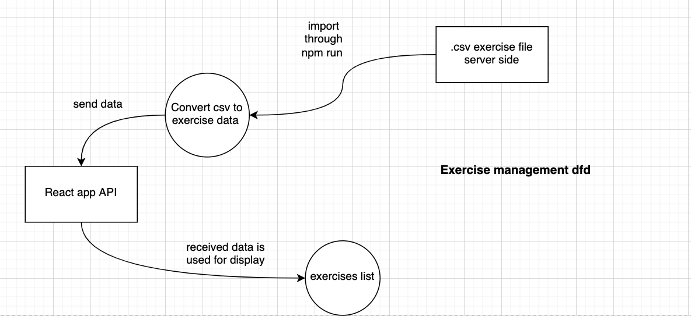
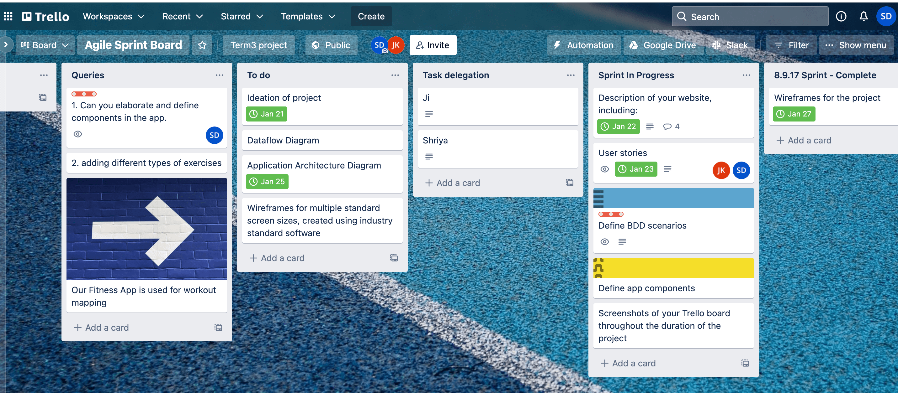
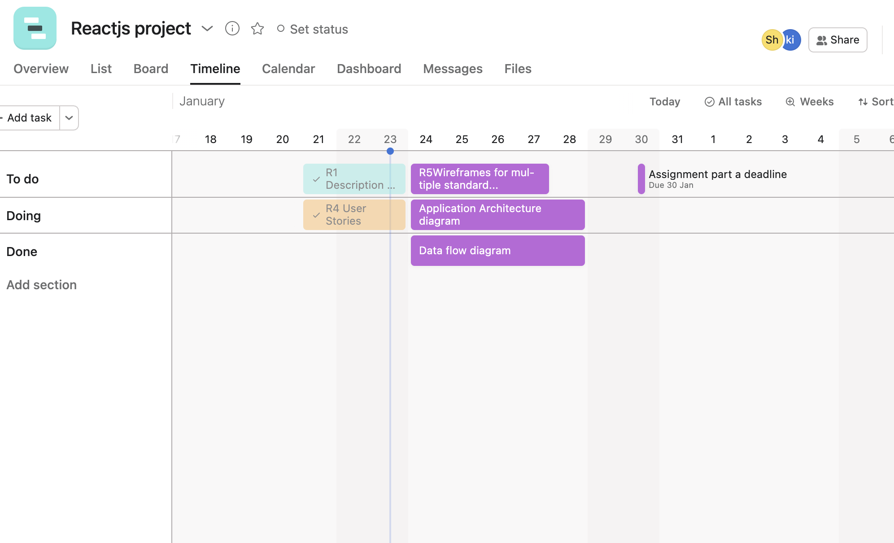

## R1.	Description of the app

- **Description and purpose:** 

The app our team will build is a fitness tracking app for athletes and workout enthusiasts. The purpose of the app is to help users to log their fitness performance for a variety of exercises including weight lifting, running and cycling. This app can help users set their fitness goals and track their performance over time.

- **Functionality / features:**

    1. User signup. A user enters their username, email, password, age, weight, height, and optionally their profile picture when signing up.
    2. User login. A user enter their email or username, and password to login.
    3. User signout.
    4. Select an exercise. A user can select their exercise that they want to keep track of.
    5. Exercise log entry. After a user selects their exercise, they can enter in the specific details of their exercise (e.g. weight and reps).

- **Target audience:** 

The target audience is anyone that wants to track their fitness.

- **Tech stack:** 

The technology stack used for this project is known as the MERN stack, which consists of MongoDB, ExpressJS, React, and NodeJS.

## R2.	Dataflow Diagram 

Dataflow diagram will help to have a visual representation of the flow of information in the application. It includes using various symbols to represent processes, data stores, external entities and data flow. 

**1. Process:**

It represents the logical processing of input data to produce and output data.

**2. Data store:**

It represents the data storage of inputs received from users that can be used for later use for retracting user information.

**3. External entities:**

These represent any flow of information or data from any other external organisation, application programming interface or system. These usually represent the edges of the DFD diagrams.

**4. Data flows:**

The data flow lines represent the input and output and the flow of data through processes, external entities and data stores.

App logic dfd

Exercise list dfd

## R3.	Application Architecture Diagram

The technology stack used for this project is known as the MERN stack, which consists of MongoDB, ExpressJS, React, and NodeJS.

Our application will be fronted by a React app which will be accessed by the users directly. The React app will serve as the frontend, to provide the user interface and interaction with the users. The users will not be allowed to access the backend web server and database directly for security reasons. The React app will be hosted on Netlify.

Our backend web server consists of NodeJS and ExpressJS. ExpressJS is a web framework that runs on top of NodeJS to create a web server. Therefore, NodeJS and ExpressJS will work together to operate as a web server and respond to HTTP requests. NodeJS and ExpressJS will set up a backend REST API server to communicate with the React app. Our backend web server will be containerised using Docker, and will be hosted on AWS Elastic Container Service (ECS).

MongoDB is used as the database to allow for persistent storage of data. It is the responsibility of NodeJS and ExpressJS to communicate with MongoDB. The frontend React app should not talk to the database as it is not a secure practice. MongoDB will be hosted on MongoDB Atlas.

Mongoose is an Object Data Modelling library for MongoDB, which allows developers to enforce schema for MongoDB at the NodeJS application layer and provides tools and features to make it easier to work with mongoDB. Mongoose will be used to communicate with the MongoDB database.

In summary, MongoDB is responsible as a database, ExpressJS and NodeJS are responsible as a backend web server, and React is responsible as a frontend app to interact with the users.

## R4.	User Stories

1. As a customer, I should be able to login into my account, so that I can view my fitness performance.

2. As a new customer,  I should be able to sign up for the app, so that I can use the app.

3. As a customer, I should be able to safely log out from my account, so that I can ensure no one is able to use my account without permission.

4.  As a customer, I should be able to select an exercise, so that I can choose from different exercises that I wish to map for performance.

5. As a customer, I should be able to log the specific details of their exercise (e.g. weight and reps), so that I am able to track increasing weights used and reps for exercise.

## R5.	Wireframes for multiple standard screen sizes, created using industry standard software

_Signup_page.png)
_Login_page.png)
_Home_page.png)
_Choose_exercise_page.png)
_Log_entry_page.png)
_Calendar_page.png)
_Dashboard_page.png)

_Signup_page.png)
_Login_page.png)
_Home_page.png)
_Choose_exercise_page.png)
_Log_entry_page.png)
_Calendar_page.png)
_Dashboard_page.png)

_Signup_page.png)
_Login_page.png)
_Home_page.png)
_Choose_exercise_page.png)
_Log_entry_page.png)
_Calendar_page.png)
_Dashboard_page.png)

## R6.	Screenshots of your Trello board throughout the duration of the project**

**Trello screenshots**

**Asana screenshots**

